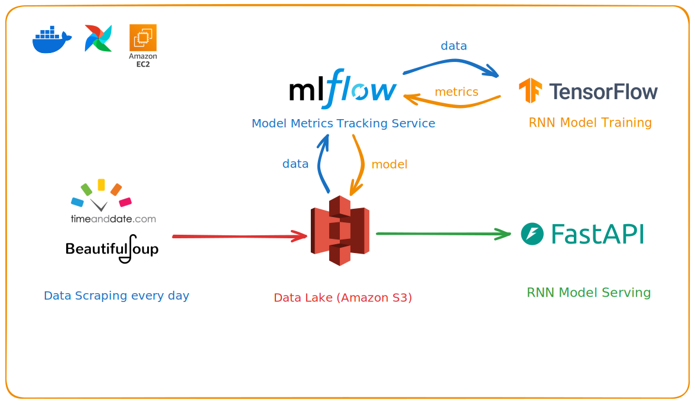

# MLOps with Airflow

A comprehensive MLOps project using Apache Airflow to automate the scraping, training, and visualization of weather forecast data.

> Training an RNN model with TensorFlow code is located in the `dags/utils/train_weather_data.py` file.



## Project Flow

> **Note:** Every logical step in the project is located in `dags/tasks/**` and `dags/utils/**`.

- **Data Scraping**: Daily scraping of weather data for Ho Chi Minh City from [timeanddate.com](https://www.timeanddate.com/weather/vietnam/ho-chi-minh-city) using Apache Airflow and `selenium`.
- **Data Upload**: Upload the processed weather data to an S3 bucket using `s3fs`.
- **Model Training**: Train an RNN model with TensorFlow to predict weather for the upcoming week.
- **Model Monitoring**: Monitor the model's performance using MLflow.
- **Model Deployment**: Deploy the model to a REST API using FastAPI.


## Getting Started

1. Clone the repository:
```bash
git clone https://github.com/thangbuiq/mlops-weather-forecast
cd mlops-weather-forecast
```

2. Start the whole stack with Docker Compose:

> **Note:** The whole system will take up to 1.5 GB of memory and 7.0 GB of disk space.

```bash
docker compose up -d
```
1. Alternatively, you can run:

> **Note:** This will require `build-essential` to be installed.

```bash
make aup
```


> Access the Airflow UI at [http://localhost:8080](http://localhost:8080).
> Access the MLflow UI at [http://localhost:5000](http://localhost:5000).

**Note:** You can use the `docs/.env.example` file to create a `.env` file (in root folder) with the necessary environment variables:
- `AIRFLOW_IMAGE_NAME`: Docker image tag for Airflow (e.g., `slim-2.9.3-python3.10`)
- `AIRFLOW_UID`: User ID for the Airflow user (e.g., `1000`)
- `_AIRFLOW_WWW_USER_USERNAME`: Username for accessing the Airflow UI
- `_AIRFLOW_WWW_USER_PASSWORD`: Password for accessing the Airflow UI
- `AWS_ACCESS_KEY_ID`: AWS access key
- `AWS_SECRET_ACCESS_KEY`: AWS secret access key
- `AWS_S3_BUCKET_NAME`: Name of the S3 bucket


## Contributing

Contributions are welcome! Please open an issue or submit a pull request.

## License

This project is licensed under the MIT License - see the [LICENSE](LICENSE) file for details.

## Contact

For any questions or suggestions, please contact [thangbuiq.work@gmail.com](mailto:thangbuiq.work@gmail.com).
