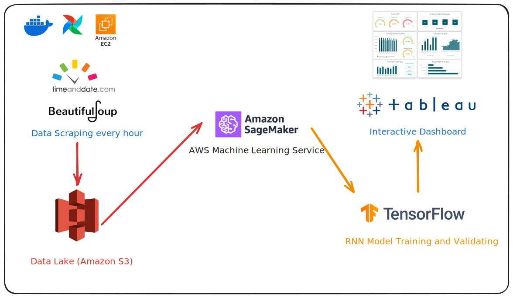

# MLOps with Airflow

A simple MLOps project using Apache Airflow to automate the training and deployment of a machine learning model.



## Getting Started

1. Clone the repository
2. Start the Airflow server

> [!NOTE]
> You can following the `.env.example` file to create a `.env` file with the necessary environment variables:
> - `AIRFLOW_IMAGE_NAME`: I used `slim-2.9.3-python3.10` tag of the `apache/airflow` image
> - `AIRFLOW_UID`: the user id of the Airflow user (i used `1000`)
> - `_AIRFLOW_WWW_USER_USERNAME`: username to access the Airflow UI
> - `_AIRFLOW_WWW_USER_PASSWORD`: password to access the Airflow UI
> - `AWS_ACCESS_KEY_ID`: AWS access key
> - `AWS_SECRET_ACCESS_KEY`: AWS secret access key
> - `AWS_S3_BUCKET_NAME`: the name of the S3 bucket

```bash
docker compose up -f docker-compose.airflow.yaml

# Access the Airflow UI at http://localhost:8080, or run:
make aup # this will require build-essential
```